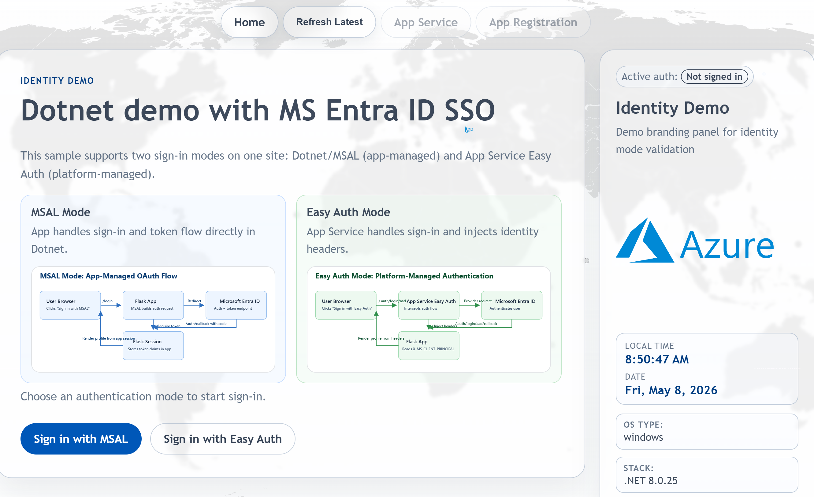
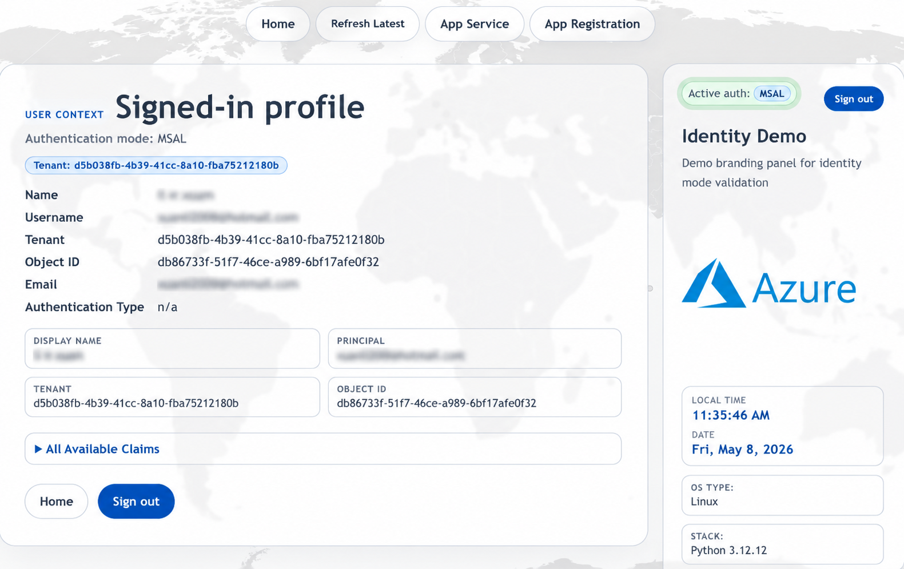

# web-ccoedemo-dotnet

ASP.NET Core (`net8.0`) Microsoft Entra authentication demo site for Azure App Service.

## Screenshot

## Map of Content

| Document | Purpose |
| --- | --- |
| [README.md](/n:/home/administrator/Documents/GitHub/CCOE-Azure/IaC/web-ccoedemo-dotnet/README.md) | Repo overview, current scope, and quick links into the project. |
| [docs/ARCHITECTURE.md](/n:/home/administrator/Documents/GitHub/CCOE-Azure/IaC/web-ccoedemo-dotnet/docs/ARCHITECTURE.md) | Application architecture, runtime components, and the MSAL versus Easy Auth request flows. |
| [docs/aadsso.md](/n:/home/administrator/Documents/GitHub/CCOE-Azure/IaC/web-ccoedemo-dotnet/docs/aadsso.md) | Easy Auth plus Entra ID SSO access-control layers and the portal settings that affect sign-in behavior. |
| [docs/DEPLOYMENT_METHODS.md](/n:/home/administrator/Documents/GitHub/CCOE-Azure/IaC/web-ccoedemo-dotnet/docs/DEPLOYMENT_METHODS.md) | Side-by-side comparison of Azure DevOps, GitHub Actions, Run From Package, Deployment Center, and container-based deployment options. |
| [docs/PIPELINE.md](/n:/home/administrator/Documents/GitHub/CCOE-Azure/IaC/web-ccoedemo-dotnet/docs/PIPELINE.md) | Focused walkthrough of the primary Azure DevOps pipeline and the alternate manual package-mounted pipeline. |

## Current Scope

- Demonstrates both MSAL and Easy Auth patterns in one site
- Uses MVC and Razor views from the repo root
- Uses `azure-pipelines.yml` as the primary ZIP deploy pipeline on `main`
- Includes an alternate manual `run_from_package.yml` pipeline with triggers disabled by default
- Includes `.github/workflows/azure-webapp.yml` for GitHub Actions build, deploy, and mirror-publish flows
- Includes deeper design notes in `docs/ARCHITECTURE.md`

## Key Files

- `Program.cs`
- `Controllers/`
- `Views/`
- `Services/`
- `azure-pipelines.yml`
- `run_from_package.yml`
- `docs/ARCHITECTURE.md`
- `docs/aadsso.md`
- `docs/PIPELINE.md`
- `.github/workflows/azure-webapp.yml`
- `docs/DEPLOYMENT_METHODS.md`

## Notes

- The deploy stage supports primary, secondary, and third App Service targets.
- Secondary and third targets are optional and are skipped safely when blank or not found.
- The deployment flow now uses `AzureCLI@2` and `az webapp deploy` rather than `AzureWebApp@1`.
- The primary deployment method is ZIP deploy of published output with `WEBSITE_RUN_FROM_PACKAGE` removed before deployment.
- The alternate package-mounted method in `run_from_package.yml` sets `WEBSITE_RUN_FROM_PACKAGE=1` and is intended for manual use.
- The GitHub Actions workflow follows the sibling app pipeline pattern with separate build, deployment precheck, deploy, pre-publish check, and mirror-publish jobs.
- GitHub Actions deployment checks branch-specific Azure auth before deploy and uses repository variables `STAGE_REPO_URL` and `ADO_REPO_URL` plus secrets `STAGE_REPO_TOKEN` and `ADO_REPO_PAT` for optional mirror publishing.
- Missing mirror-publish variables or secrets emit warnings and skip only the affected publish job, matching the sibling repo behavior.
- A focused pipeline walkthrough is available in [docs/PIPELINE.md](/n:/home/administrator/Documents/GitHub/CCOE-Azure/IaC/web-ccoedemo-dotnet/docs/PIPELINE.md).
- Architecture details live in [docs/ARCHITECTURE.md](/n:/home/administrator/Documents/GitHub/CCOE-Azure/IaC/web-ccoedemo-dotnet/docs/ARCHITECTURE.md), and the Easy Auth access-control note lives in [docs/aadsso.md](/n:/home/administrator/Documents/GitHub/CCOE-Azure/IaC/web-ccoedemo-dotnet/docs/aadsso.md).
- The package remains Windows-friendly because it includes `web.config`, but the pipeline can deploy to either Windows or Linux App Service depending on the target app's OS.
- Broader App Service options such as Deployment Center and custom containers are documented in [docs/DEPLOYMENT_METHODS.md](/n:/home/administrator/Documents/GitHub/CCOE-Azure/IaC/web-ccoedemo-dotnet/docs/DEPLOYMENT_METHODS.md), but they are not implemented by this repo.
- This repo is already well-documented; this README is kept as the current snapshot rather than a placeholder.
- Pre-commit is enabled with lightweight file hygiene checks for local commits.
